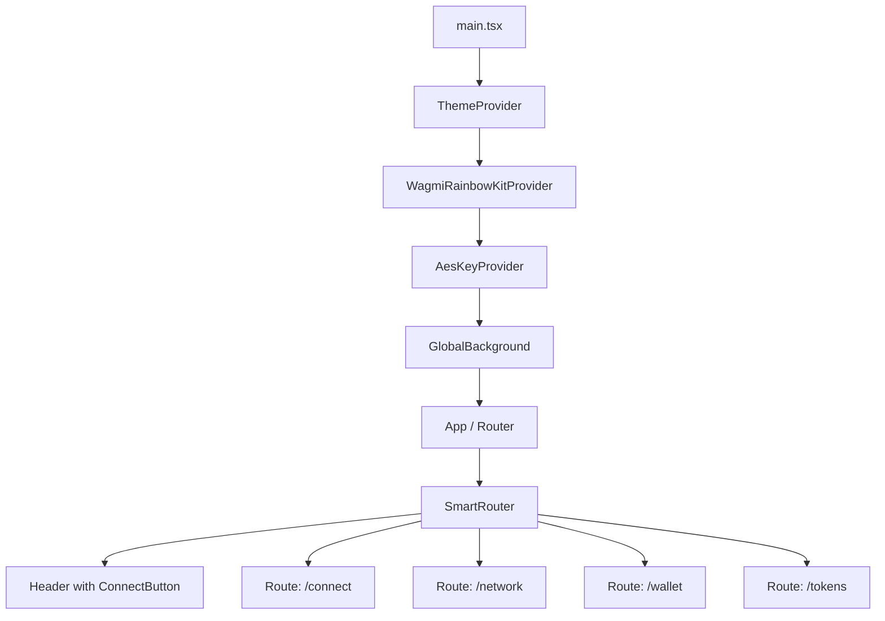
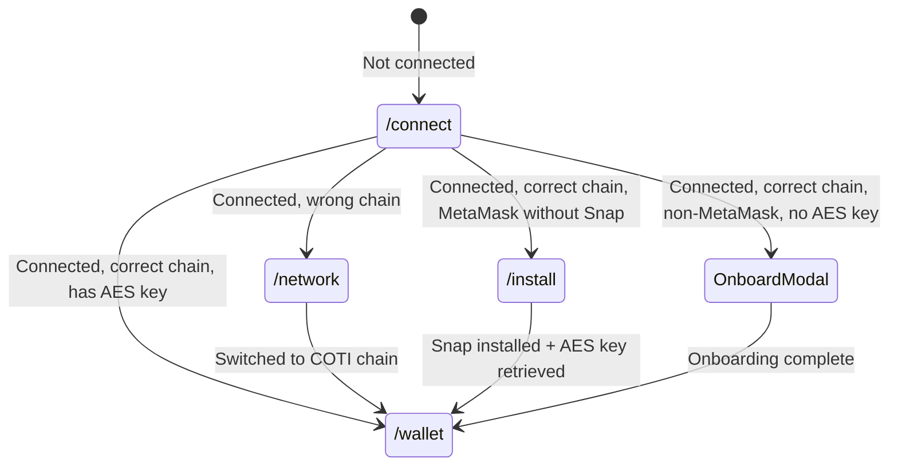

# Design Document: RainbowKit Wallet Connection

## Overview

This design describes the migration of the `packages/site` frontend from a MetaMask-only Snap-based wallet connection to a multi-wallet architecture powered by `@coti-io/coti-wallet-plugin` and RainbowKit. The migration replaces the existing provider hierarchy (`WagmiProvider` → `QueryClientProvider` → `MetaMaskProvider` → `SnapProvider`) with the plugin's `WagmiRainbowKitProvider` and a new lightweight `AesKeyContext` that delegates wallet-type detection and AES key retrieval to the plugin's hooks.

The key architectural shift is from a single-path flow (MetaMask → Snap → AES key) to a branching flow where the wallet type determines the AES key retrieval strategy: MetaMask users continue using the Snap RPC interface, while non-MetaMask users (Coinbase Wallet, WalletConnect, Rainbow) use the COTI Onboarding Contract.

## Architecture

### High-Level Component Hierarchy (After Migration)



### Provider Replacement Strategy

| Before | After |
|--------|-------|
| `WagmiProvider` (custom config) | `WagmiRainbowKitProvider` (plugin-managed) |
| `QueryClientProvider` | Included in `WagmiRainbowKitProvider` |
| `MetaMaskProvider` | Removed — wallet detection via `useWalletType()` |
| `SnapProvider` | Replaced by `AesKeyProvider` (wraps plugin hooks) |

### Navigation Flow (After Migration)



### Key Design Decisions

1. **Plugin as single source of truth for wallet management**: The plugin's `WagmiRainbowKitProvider` owns wagmi config, QueryClient, and RainbowKit setup. The site no longer maintains its own `config/wagmi.ts` connectors.

2. **Thin AesKeyContext**: Instead of the 1000+ line `SnapContext`, a new `AesKeyContext` delegates to the plugin's `useWalletType()` and `useAesKeyProvider()` hooks, exposing only `{ aesKey, isOnboarding, error, getAesKey }` to consumers.

3. **Conditional Snap usage**: The Snap RPC path is only activated when `walletTypeInfo.isMetaMaskWithSnap === true`. Non-MetaMask wallets never interact with Snap code.

4. **Route simplification**: The `/install` route is retained only for MetaMask users who need the Snap. Non-MetaMask users skip directly from `/connect` → `/network` → `/wallet` (with OnboardModal shown inline).

5. **AES key held in memory only**: The key is stored in React state within `AesKeyContext` and never persisted to localStorage or any storage mechanism.

## Components and Interfaces

### New Components

#### `AesKeyProvider` (Context Provider)
```typescript
// hooks/AesKeyContext.tsx
interface AesKeyContextValue {
  aesKey: string | null;
  isOnboarding: boolean;
  onboardingError: string | null;
  walletType: 'metamask-snap' | 'metamask-no-snap' | 'non-metamask' | null;
  getAesKey: () => Promise<void>;
  clearAesKey: () => void;
  showOnboardModal: boolean;
  setShowOnboardModal: (show: boolean) => void;
}
```

**Responsibilities:**
- Wraps `useWalletType()` and `useAesKeyProvider()` from the plugin
- Exposes a unified interface for AES key state to all child components
- Manages OnboardModal visibility state
- Clears AES key on disconnect

#### `ConnectPage` (Replaces `ContentConnectYourWallet`)
```typescript
// components/ConnectPage.tsx
// Renders RainbowKit's ConnectButton component
// Triggers the wallet picker modal on click
```

#### `OnboardingWrapper` (New)
```typescript
// components/OnboardingWrapper.tsx
interface OnboardingWrapperProps {
  children: React.ReactNode;
}
// Renders the Plugin's OnboardModal when a non-MetaMask wallet
// connects and needs AES key onboarding
```

### Modified Components

#### `main.tsx`
- Remove: `WagmiProvider`, `QueryClientProvider`, `MetaMaskProvider`, `SnapProvider`
- Add: `WagmiRainbowKitProvider`, `AesKeyProvider`
- Add: `configureCotiPlugin()` call before render
- Add: `import '@rainbow-me/rainbowkit/styles.css'`

#### `SmartRouter`
- Remove: `useMetaMask()` dependency, MetaMask install screen, mobile-only restriction
- Replace: `installedSnap` checks with `walletType` from `AesKeyContext`
- Keep: `useAccount()` for connection state, `useWrongChain()` for network state
- Add: Route to `/install` only when `walletType === 'metamask-no-snap'`

#### `Header`
- Replace: Custom connect button with RainbowKit's `ConnectButton` component
- The `ConnectButton` handles connected state display (address, avatar, chain)

#### Router (`router/index.tsx`)
- Remove: `SnapProtectedRoute` (replaced by AES key check)
- Remove: `InstallProtectedRoute` (conditional on wallet type)
- Add: `AesKeyProtectedRoute` that checks `aesKey !== null`
- Modify: `/wallet` and `/tokens` routes use `AesKeyProtectedRoute`

### Plugin API Usage

```typescript
// Application startup (before React render)
import { configureCotiPlugin } from '@coti-io/coti-wallet-plugin';

configureCotiPlugin({
  snapId: 'npm:@coti-io/coti-snap', // or local:http://localhost:8080
  defaultNetworkId: 2632500, // COTI Mainnet
});
```

```typescript
// Inside AesKeyProvider
import { useWalletType, useAesKeyProvider } from '@coti-io/coti-wallet-plugin';

const walletTypeInfo = useWalletType();
const { getAesKey, isOnboarding, onboardingError } = useAesKeyProvider(walletTypeInfo);
```

```typescript
// OnboardModal usage
import { OnboardModal } from '@coti-io/coti-wallet-plugin';

<OnboardModal
  isOpen={showOnboardModal}
  onClose={() => setShowOnboardModal(false)}
  onConfirm={handleOnboardConfirm}
  isLoading={isOnboarding}
  error={onboardingError}
  walletType={walletTypeInfo.walletType}
  sessionAesKey={aesKey}
/>
```

### Removed Files

| File | Reason |
|------|--------|
| `hooks/MetamaskContext.tsx` | Replaced by plugin's wallet detection |
| `hooks/useMetaMask.ts` | Snap polling replaced by plugin's `useWalletType()` |
| `hooks/useInvokeSnap.ts` | Snap RPC handled by plugin's `useSnap()` |
| `hooks/useRequestSnap.ts` | Snap installation handled by plugin |
| `hooks/useRequest.ts` | Low-level request helper no longer needed |
| `utils/metamask.ts` | MetaMask detection utilities replaced |
| `config/wagmi.ts` | Wagmi config managed by plugin (chain definitions kept as constants) |

### Retained Files (Modified)

| File | Changes |
|------|---------|
| `hooks/SnapContext.tsx` | Removed entirely — functionality moved to `AesKeyContext` |
| `components/ContentInstallAESKeyManager.tsx` | Kept for MetaMask-only snap install flow |

## Data Models

### AES Key State

```typescript
// In-memory only, never persisted
interface AesKeyState {
  key: string | null;        // The AES key (hex string), null when not retrieved
  chainId: number | null;    // Chain the key is associated with
}
```

### Wallet Type Info (from Plugin)

```typescript
interface WalletTypeInfo {
  isMetaMaskWithSnap: boolean;   // MetaMask connected AND Snap installed
  walletType: string;            // 'metaMask' | 'coinbaseWallet' | 'walletConnect' | 'rainbow'
  connectorId: string;           // wagmi connector ID
}
```

### Route Guard State

```typescript
interface NavigationState {
  isConnected: boolean;          // From wagmi useAccount()
  isCorrectNetwork: boolean;     // COTI Mainnet or Testnet
  walletType: WalletTypeInfo;    // From plugin
  hasAesKey: boolean;            // AES key retrieved and in memory
  needsSnapInstall: boolean;     // MetaMask without Snap
  needsOnboarding: boolean;      // Non-MetaMask without AES key
}
```

### Environment Configuration

```typescript
interface PluginConfig {
  snapId: string;                // 'npm:@coti-io/coti-snap' or local dev URL
  defaultNetworkId: number;      // 2632500 (mainnet) or 7082400 (testnet)
  walletConnectProjectId: string; // From VITE_WALLETCONNECT_PROJECT_ID env var
}
```

